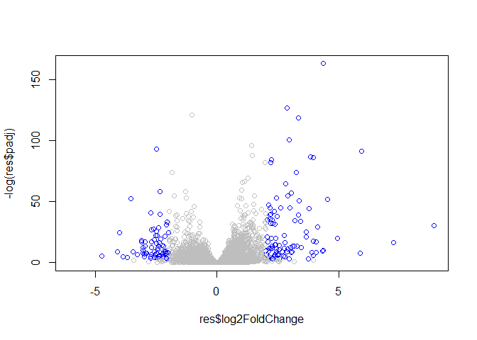
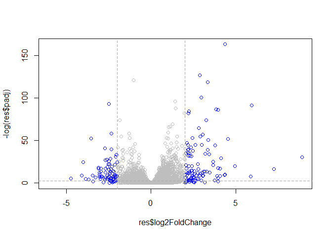

Transcriptomics and the analysis of RNA-seq data
================

## Import today’s data

The data for this hands-on session comes from a published RNA-seq
experiment where airway smooth muscle cells were treated with
dexamethasone, a synthetic glucocorticoid steroid with anti-inflammatory
effects (Himes et al. 2014).

Glucocorticoids are used, for example, by people with asthma to reduce
inflammation of the airways. The anti-inflammatory effects on airway
smooth muscle (ASM) cells has been known for some time but the
underlying molecular mechanisms are unclear.

``` r
counts <- read.csv("airway_scaledcounts.csv", stringsAsFactors = FALSE)
metadata <-  read.csv("airway_metadata.csv", stringsAsFactors = FALSE)
```

How many genes are we dealing with?

``` r
nrow(counts)
```

    ## [1] 38694

We want to calculate the average counts per gene for control samples and
te for the drug treated samples. We will then compare theses values to
see if there is a difference overall between control and treated samples
for a given gene

This is our ‘metadata’ info that tells me where our control and treated
samples are (i.e. which columns in ‘counts’)

``` r
metadata
```

    ##           id     dex celltype     geo_id
    ## 1 SRR1039508 control   N61311 GSM1275862
    ## 2 SRR1039509 treated   N61311 GSM1275863
    ## 3 SRR1039512 control  N052611 GSM1275866
    ## 4 SRR1039513 treated  N052611 GSM1275867
    ## 5 SRR1039516 control  N080611 GSM1275870
    ## 6 SRR1039517 treated  N080611 GSM1275871
    ## 7 SRR1039520 control  N061011 GSM1275874
    ## 8 SRR1039521 treated  N061011 GSM1275875

I want to access the control only rows in the metadata

``` r
control <- metadata[metadata$dex == "control", ]
control
```

    ##           id     dex celltype     geo_id
    ## 1 SRR1039508 control   N61311 GSM1275862
    ## 3 SRR1039512 control  N052611 GSM1275866
    ## 5 SRR1039516 control  N080611 GSM1275870
    ## 7 SRR1039520 control  N061011 GSM1275874

``` r
# metadata$id[metadata$dex == "control"]
```

Now use the $id of the control data to access the control columns in
counts and calulate the average

``` r
control.mean <- rowSums(counts[, control$id]) / nrow(control)
names(control.mean) <- counts$ensgene
```

Now I will do the same for treated data

``` r
treated <- metadata[metadata$dex == "treated", ]
treated
```

    ##           id     dex celltype     geo_id
    ## 2 SRR1039509 treated   N61311 GSM1275863
    ## 4 SRR1039513 treated  N052611 GSM1275867
    ## 6 SRR1039517 treated  N080611 GSM1275871
    ## 8 SRR1039521 treated  N061011 GSM1275875

``` r
treated.mean <- rowSums(counts[, treated$id]) / nrow(treated)
```

We will combine our meancount data for bookeeping purposes

``` r
meancounts <- data.frame(control.mean, treated.mean)
head(meancounts)
```

    ##                 control.mean treated.mean
    ## ENSG00000000003       900.75       658.00
    ## ENSG00000000005         0.00         0.00
    ## ENSG00000000419       520.50       546.00
    ## ENSG00000000457       339.75       316.50
    ## ENSG00000000460        97.25        78.75
    ## ENSG00000000938         0.75         0.00

Let’s plot control.mean vs treated.mean

``` r
plot(meancounts)
```

<!-- -->

Let’s make this plot a log-log plot

``` r
plot.default(meancounts, log = "xy")
```

    ## Warning in xy.coords(x, y, xlabel, ylabel, log): 15032 x values <= 0 omitted
    ## from logarithmic plot

    ## Warning in xy.coords(x, y, xlabel, ylabel, log): 15281 y values <= 0 omitted
    ## from logarithmic plot

<!-- -->

We can find candidate differentially expressed genes by looking for
genes with a large change between control and dex-treated samples. We
usually look at the log2 of the fold change, because this has better
mathematical properties.

Here we calculate log2foldchange, add it to our meancounts data.frame
and inspect the results either with the head() or the View() function
for example.

``` r
meancounts$log2fc <- log2(meancounts[,"treated.mean"]/meancounts[,"control.mean"])
head(meancounts)
```

    ##                 control.mean treated.mean      log2fc
    ## ENSG00000000003       900.75       658.00 -0.45303916
    ## ENSG00000000005         0.00         0.00         NaN
    ## ENSG00000000419       520.50       546.00  0.06900279
    ## ENSG00000000457       339.75       316.50 -0.10226805
    ## ENSG00000000460        97.25        78.75 -0.30441833
    ## ENSG00000000938         0.75         0.00        -Inf

Remove any gene that has zero average counts

``` r
x <- data.frame(c(1, 1, 10, 0), c(0, 1, 10, 0))
#x
#x == 0
ind <- unique(which(x == 0, arr.ind = TRUE)[, "row"])
x[ind, ]
```

    ##   c.1..1..10..0. c.0..1..10..0.
    ## 4              0              0
    ## 1              1              0

``` r
zero.vals <- which(meancounts[,1:2]==0, arr.ind=TRUE)

to.rm <- unique(zero.vals[,1])
mycounts <- meancounts[-to.rm,]
head(mycounts)
```

    ##                 control.mean treated.mean      log2fc
    ## ENSG00000000003       900.75       658.00 -0.45303916
    ## ENSG00000000419       520.50       546.00  0.06900279
    ## ENSG00000000457       339.75       316.50 -0.10226805
    ## ENSG00000000460        97.25        78.75 -0.30441833
    ## ENSG00000000971      5219.00      6687.50  0.35769358
    ## ENSG00000001036      2327.00      1785.75 -0.38194109

How many genes do I have left?

``` r
nrow(mycounts)
```

    ## [1] 21817

A common threshold used for calling something differentially expressed
is a log2(FoldChange) of greater than 2 or less than -2. Let’s filter
the dataset both ways to see how many genes are up or down-regulated.

``` r
up.ind <- mycounts$log2fc > 2
down.ind <- mycounts$log2fc < (-2)
```

``` r
sum(up.ind)
```

    ## [1] 250

``` r
sum(down.ind)
```

    ## [1] 367

## Do this properly with DESeq2

``` r
library(DESeq2)
```

    ## Loading required package: S4Vectors

    ## Loading required package: stats4

    ## Loading required package: BiocGenerics

    ## Loading required package: parallel

    ## 
    ## Attaching package: 'BiocGenerics'

    ## The following objects are masked from 'package:parallel':
    ## 
    ##     clusterApply, clusterApplyLB, clusterCall, clusterEvalQ,
    ##     clusterExport, clusterMap, parApply, parCapply, parLapply,
    ##     parLapplyLB, parRapply, parSapply, parSapplyLB

    ## The following objects are masked from 'package:stats':
    ## 
    ##     IQR, mad, sd, var, xtabs

    ## The following objects are masked from 'package:base':
    ## 
    ##     anyDuplicated, append, as.data.frame, basename, cbind, colnames,
    ##     dirname, do.call, duplicated, eval, evalq, Filter, Find, get, grep,
    ##     grepl, intersect, is.unsorted, lapply, Map, mapply, match, mget,
    ##     order, paste, pmax, pmax.int, pmin, pmin.int, Position, rank,
    ##     rbind, Reduce, rownames, sapply, setdiff, sort, table, tapply,
    ##     union, unique, unsplit, which, which.max, which.min

    ## 
    ## Attaching package: 'S4Vectors'

    ## The following object is masked from 'package:base':
    ## 
    ##     expand.grid

    ## Loading required package: IRanges

    ## 
    ## Attaching package: 'IRanges'

    ## The following object is masked from 'package:grDevices':
    ## 
    ##     windows

    ## Loading required package: GenomicRanges

    ## Loading required package: GenomeInfoDb

    ## Loading required package: SummarizedExperiment

    ## Loading required package: Biobase

    ## Welcome to Bioconductor
    ## 
    ##     Vignettes contain introductory material; view with
    ##     'browseVignettes()'. To cite Bioconductor, see
    ##     'citation("Biobase")', and for packages 'citation("pkgname")'.

    ## Loading required package: DelayedArray

    ## Loading required package: matrixStats

    ## 
    ## Attaching package: 'matrixStats'

    ## The following objects are masked from 'package:Biobase':
    ## 
    ##     anyMissing, rowMedians

    ## Loading required package: BiocParallel

    ## 
    ## Attaching package: 'DelayedArray'

    ## The following objects are masked from 'package:matrixStats':
    ## 
    ##     colMaxs, colMins, colRanges, rowMaxs, rowMins, rowRanges

    ## The following objects are masked from 'package:base':
    ## 
    ##     aperm, apply, rowsum

Setup input for DESeq2 by specifying countdata, metadata and the design
(i.e. which comparisons we are interested in)

``` r
dds <- DESeqDataSetFromMatrix(countData=counts, 
                              colData=metadata, 
                              design=~dex, 
                              tidy=TRUE)
```

    ## converting counts to integer mode

    ## Warning in DESeqDataSet(se, design = design, ignoreRank): some variables in
    ## design formula are characters, converting to factors

``` r
dds
```

    ## class: DESeqDataSet 
    ## dim: 38694 8 
    ## metadata(1): version
    ## assays(1): counts
    ## rownames(38694): ENSG00000000003 ENSG00000000005 ... ENSG00000283120
    ##   ENSG00000283123
    ## rowData names(0):
    ## colnames(8): SRR1039508 SRR1039509 ... SRR1039520 SRR1039521
    ## colData names(4): id dex celltype geo_id

``` r
dds <- DESeq(dds)
```

    ## estimating size factors

    ## estimating dispersions

    ## gene-wise dispersion estimates

    ## mean-dispersion relationship

    ## final dispersion estimates

    ## fitting model and testing

``` r
results(dds)
```

    ## log2 fold change (MLE): dex treated vs control 
    ## Wald test p-value: dex treated vs control 
    ## DataFrame with 38694 rows and 6 columns
    ##                          baseMean     log2FoldChange             lfcSE
    ##                         <numeric>          <numeric>         <numeric>
    ## ENSG00000000003  747.194195359907 -0.350703020686589 0.168245681332903
    ## ENSG00000000005                 0                 NA                NA
    ## ENSG00000000419  520.134160051965  0.206107766417874 0.101059218008481
    ## ENSG00000000457  322.664843927049 0.0245269479387461 0.145145067649738
    ## ENSG00000000460   87.682625164828 -0.147142049222083 0.257007253995456
    ## ...                           ...                ...               ...
    ## ENSG00000283115                 0                 NA                NA
    ## ENSG00000283116                 0                 NA                NA
    ## ENSG00000283119                 0                 NA                NA
    ## ENSG00000283120 0.974916032393564 -0.668258460516795  1.69456285242458
    ## ENSG00000283123                 0                 NA                NA
    ##                               stat             pvalue              padj
    ##                          <numeric>          <numeric>         <numeric>
    ## ENSG00000000003  -2.08446967499072 0.0371174658436988 0.163034808643509
    ## ENSG00000000005                 NA                 NA                NA
    ## ENSG00000000419   2.03947517583776 0.0414026263009679  0.17603166488093
    ## ENSG00000000457  0.168982303952169  0.865810560624016 0.961694238404893
    ## ENSG00000000460 -0.572520996721302  0.566969065259218  0.81584858763974
    ## ...                            ...                ...               ...
    ## ENSG00000283115                 NA                 NA                NA
    ## ENSG00000283116                 NA                 NA                NA
    ## ENSG00000283119                 NA                 NA                NA
    ## ENSG00000283120 -0.394354484733718  0.693319342567684                NA
    ## ENSG00000283123                 NA                 NA                NA

``` r
res <- results(dds)
res
```

    ## log2 fold change (MLE): dex treated vs control 
    ## Wald test p-value: dex treated vs control 
    ## DataFrame with 38694 rows and 6 columns
    ##                          baseMean     log2FoldChange             lfcSE
    ##                         <numeric>          <numeric>         <numeric>
    ## ENSG00000000003  747.194195359907 -0.350703020686589 0.168245681332903
    ## ENSG00000000005                 0                 NA                NA
    ## ENSG00000000419  520.134160051965  0.206107766417874 0.101059218008481
    ## ENSG00000000457  322.664843927049 0.0245269479387461 0.145145067649738
    ## ENSG00000000460   87.682625164828 -0.147142049222083 0.257007253995456
    ## ...                           ...                ...               ...
    ## ENSG00000283115                 0                 NA                NA
    ## ENSG00000283116                 0                 NA                NA
    ## ENSG00000283119                 0                 NA                NA
    ## ENSG00000283120 0.974916032393564 -0.668258460516795  1.69456285242458
    ## ENSG00000283123                 0                 NA                NA
    ##                               stat             pvalue              padj
    ##                          <numeric>          <numeric>         <numeric>
    ## ENSG00000000003  -2.08446967499072 0.0371174658436988 0.163034808643509
    ## ENSG00000000005                 NA                 NA                NA
    ## ENSG00000000419   2.03947517583776 0.0414026263009679  0.17603166488093
    ## ENSG00000000457  0.168982303952169  0.865810560624016 0.961694238404893
    ## ENSG00000000460 -0.572520996721302  0.566969065259218  0.81584858763974
    ## ...                            ...                ...               ...
    ## ENSG00000283115                 NA                 NA                NA
    ## ENSG00000283116                 NA                 NA                NA
    ## ENSG00000283119                 NA                 NA                NA
    ## ENSG00000283120 -0.394354484733718  0.693319342567684                NA
    ## ENSG00000283123                 NA                 NA                NA

``` r
plot(res$log2FoldChange, res$padj)
```

<!-- -->

``` r
plot(res$log2FoldChange, log(res$padj))
```

<!-- -->

Let’s plot this the way the rest of the world does

``` r
plot(res$log2FoldChange, -log(res$padj),)
```

<!-- -->

We need to add ‘sig’ column to our ‘res’ data. This will evaluate to
TRUE if padj \< 0.05 AND the absolute log2FoldChange \>2, FALSE if not
the case.

``` r
res$sig <- res$padj < 0.05 & abs(res$log2FoldChange) > 2
```

If padj is also NA

``` r
sum(is.na(res$sig))
```

    ## [1] 14245

``` r
palette(c("gray", "blue"))
plot(res$log2FoldChange, -log(res$padj),
     col = res$sig+1)
```

<!-- -->

``` r
mycols <- rep("gray", nrow(res))
mycols[res$log2FoldChange > 2] <- "blue"
mycols[res$log2FoldChange < -2] <- "blue"
plot(res$log2FoldChange, -log(res$padj), col = mycols)
  abline(v = c(-2, 2), col = "darkgray", lty = 2)
  abline(h = -log(0.1), col = "darkgray", lty = 2)
```

<!-- -->
