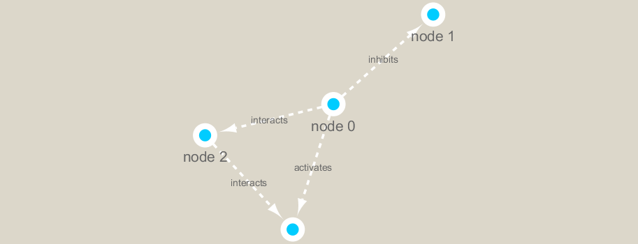

```{r setup, include=FALSE}
knitr::opts_chunk$set(echo = TRUE)
```

## First setup the packages
First setup the packages we need. These include **igraph** from CRAN and **RCy3** from bioconductor.

I installed these with **install.packages()** and **BiocManager::install("RCy3")**.

```{r}
library(RCy3)
```

Let's check we can talk to cytoscape from R. Note that cytoscape must be running at this point.

```{r}
#cytoscapePing()
```

We can test things further by making a small network (here in igraph format as used by the R igraph package) and sending it to Cytoscape:

```{r}
#g <- makeSimpleIgraph()
#createNetworkFromIgraph(g,"myGraph")
```

```{r}
#setVisualStyle("Marquee")
```

Save an image from cytoscape and include it in my report here:

```{r}
#fig<- exportImage(filename="demo_marquee", type="png", height=350)

#
```

We can also plot this simple network in R itself
```{r}
#plot(g)
```

## Read our metagenomics data

Our data from today comes from the TARA oceans study. 

```{r}
## scripts for processing located in "inst/data-raw/"
prok_vir_cor <- read.delim("virus_prok_cor_abundant.tsv", stringsAsFactors = FALSE)

## Have a peak at the first 6 rows
head(prok_vir_cor)
```
 
How many connections (i.e. edges) will we have in our network - let's look at the number of rows
```{r}
nrow(prok_vir_cor)
```

Use the igraph function to make a network from this data.frame

```{r}
library(igraph)
g <- graph.data.frame(prok_vir_cor, directed = FALSE)
plot(g)
```

This default plot is a hot mess!!!
Let's turn the node/vertex labels off and turn the size of the vertex/nodes down a bit

```{r}
plot(g, vertex.size=3, vertex.label=NA)
```

To send this network to Cytoscape we can use the command:

```{r}
#createNetworkFromIgraph(g,"myIgraph")
```

## Netowrk community detection

Let's cluster our network to find "community" structure...

Community structure detection algorithms try to find dense sub-graphs within larger network graphs (i.e. clusters of well connected nodes that are densely connected themselves but sparsely connected to other nodes outside the cluster) . Here we use the classic Girvan & Newman betweenness clustering method. The igraph package has lots of different community detection algorithms (i.e. different methods for finding communities).

```{r}
cb <- cluster_edge_betweenness(g)
```

```{r}
plot(cb, y=g, vertex.label=NA,  vertex.size=3)
```


