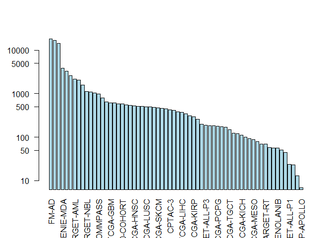
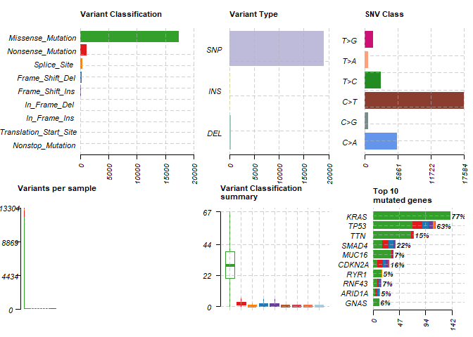

Class 18: Investigating cancer genomics datasets
================

## Connect to the NCI-GDC database

The NCI-GDC (cancer genomic commons) is a major portal for cancer
genomics data.

Here we use the bioconductor package **GenomicDataCommons** to talk to
this database and download data etc. all from R.

``` r
library(GenomicDataCommons)
```

    ## Loading required package: magrittr

    ## 
    ## Attaching package: 'GenomicDataCommons'

    ## The following object is masked from 'package:stats':
    ## 
    ##     filter

``` r
library(TCGAbiolinks)
library(maftools)
```

Can we talk to the online database?

``` r
status()
```

    ## $commit
    ## [1] "5f1e6fc978afd5a6d1afafcdff04311f888bd210"
    ## 
    ## $data_release
    ## [1] "Data Release 22.0 - January 16, 2020"
    ## 
    ## $status
    ## [1] "OK"
    ## 
    ## $tag
    ## [1] "2.1.0"
    ## 
    ## $version
    ## [1] 1

## Querying the GDC from R

The pipe operator can be useful in R and sometimes is more clear to
read.

``` r
cases_by_project <- cases() %>%
  facet("project.project_id") %>%
  aggregations()
head(cases_by_project)
```

    ## $project.project_id
    ##                      key doc_count
    ## 1                  FM-AD     18004
    ## 2              GENIE-MSK     16824
    ## 3             GENIE-DFCI     14232
    ## 4              GENIE-MDA      3857
    ## 5              GENIE-JHU      3320
    ## 6              GENIE-UHN      2632
    ## 7             TARGET-AML      2146
    ## 8             GENIE-VICC      2052
    ## 9          TARGET-ALL-P2      1587
    ## 10            TARGET-NBL      1132
    ## 11             TCGA-BRCA      1098
    ## 12            GENIE-GRCC      1038
    ## 13         MMRF-COMMPASS       995
    ## 14             GENIE-NKI       801
    ## 15             TARGET-WT       652
    ## 16              TCGA-GBM       617
    ## 17               TCGA-OV       608
    ## 18             TCGA-LUAD       585
    ## 19     BEATAML1.0-COHORT       583
    ## 20             TCGA-UCEC       560
    ## 21             TCGA-KIRC       537
    ## 22             TCGA-HNSC       528
    ## 23              TCGA-LGG       516
    ## 24             TCGA-THCA       507
    ## 25             TCGA-LUSC       504
    ## 26             TCGA-PRAD       500
    ## 27          NCICCR-DLBCL       489
    ## 28             TCGA-SKCM       470
    ## 29             TCGA-COAD       461
    ## 30             TCGA-STAD       443
    ## 31               CPTAC-3       430
    ## 32             TCGA-BLCA       412
    ## 33             TARGET-OS       383
    ## 34             TCGA-LIHC       377
    ## 35               CPTAC-2       342
    ## 36             TCGA-CESC       307
    ## 37             TCGA-KIRP       291
    ## 38             TCGA-SARC       261
    ## 39             TCGA-LAML       200
    ## 40         TARGET-ALL-P3       191
    ## 41             TCGA-ESCA       185
    ## 42             TCGA-PAAD       185
    ## 43             TCGA-PCPG       179
    ## 44              OHSU-CNL       176
    ## 45             TCGA-READ       172
    ## 46             TCGA-TGCT       150
    ## 47             TCGA-THYM       124
    ## 48            CGCI-BLGSP       120
    ## 49             TCGA-KICH       113
    ## 50            WCDT-MCRPC       101
    ## 51              TCGA-ACC        92
    ## 52             TCGA-MESO        87
    ## 53              TCGA-UVM        80
    ## 54   ORGANOID-PANCREATIC        70
    ## 55             TARGET-RT        69
    ## 56             TCGA-DLBC        58
    ## 57              TCGA-UCS        57
    ## 58 BEATAML1.0-CRENOLANIB        56
    ## 59             TCGA-CHOL        51
    ## 60           CTSP-DLBCL1        45
    ## 61         TARGET-ALL-P1        24
    ## 62             HCMI-CMDC        23
    ## 63           TARGET-CCSK        13
    ## 64        VAREPOP-APOLLO         7

## Plot this overview data

``` r
x <- cases_by_project$project.project_id
barplot(x$doc_count,  names.arg = x$key, las = 2, col = "lightblue", log = "y")
```

<!-- -->

## Variant analysis with R

Find files available for PAAD project that we can then examine variants
from

``` r
maf.file <- GDCquery_Maf(tumor="PAAD", pipelines = "mutect")
```

    ## ============================================================================

    ##  For more information about MAF data please read the following GDC manual and web pages:

    ##  GDC manual: https://gdc-docs.nci.nih.gov/Data/PDF/Data_UG.pdf

    ##  https://gdc-docs.nci.nih.gov/Data/Bioinformatics_Pipelines/DNA_Seq_Variant_Calling_Pipeline/

    ##  https://gdc.cancer.gov/about-gdc/variant-calling-gdc

    ## ============================================================================

    ## --------------------------------------

    ## o GDCquery: Searching in GDC database

    ## --------------------------------------

    ## Genome of reference: hg38

    ## --------------------------------------------

    ## oo Accessing GDC. This might take a while...

    ## --------------------------------------------

    ## ooo Project: TCGA-PAAD

    ## --------------------

    ## oo Filtering results

    ## --------------------

    ## ooo By access

    ## ooo By data.type

    ## ooo By workflow.type

    ## ----------------

    ## oo Checking data

    ## ----------------

    ## ooo Check if there are duplicated cases

    ## ooo Check if there results for the query

    ## -------------------

    ## o Preparing output

    ## -------------------

    ## Downloading data for project TCGA-PAAD

    ## Of the 1 files for download 1 already exist.

    ## All samples have been already downloaded

    ## |=                                                                       |   1%|=                                                                       |   2%|=                                                               |   2%    1 MB|=                                                               |   2%    1 MB|==                                                              |   3%    1 MB|==                                                              |   3%    1 MB|==                                                              |   3%    1 MB|==                                                              |   3%    1 MB|==                                                              |   4%    1 MB|==                                                              |   4%    1 MB|===                                                             |   4%    2 MB|===                                                             |   5%    2 MB|===                                                             |   5%    2 MB|===                                                             |   5%    2 MB|===                                                             |   5%    2 MB|====                                                            |   6%    2 MB|====                                                            |   6%    2 MB|====                                                            |   6%    2 MB|====                                                            |   7%    2 MB|====                                                            |   7%    3 MB|====                                                            |   7%    3 MB|=====                                                           |   7%    3 MB|=====                                                           |   8%    3 MB|=====                                                           |   8%    3 MB|=====                                                           |   8%    3 MB|=====                                                           |   9%    3 MB|======                                                          |   9%    3 MB|======                                                          |   9%    4 MB|======                                                          |   9%    4 MB|======                                                          |  10%    4 MB|======                                                          |  10%    4 MB|======                                                          |  10%    4 MB|=======                                                         |  10%    4 MB|=======                                                         |  11%    4 MB|=======                                                         |  11%    4 MB|=======                                                         |  11%    4 MB|=======                                                         |  12%    5 MB|========                                                        |  12%    5 MB|========                                                        |  12%    5 MB|========                                                        |  12%    5 MB|========                                                        |  13%    5 MB|========                                                        |  13%    5 MB|========                                                        |  13%    5 MB|=========                                                       |  14%    5 MB|=========                                                       |  14%    6 MB|=========                                                       |  14%    6 MB|=========                                                       |  14%    6 MB|=========                                                       |  15%    6 MB|==========                                                      |  15%    6 MB|==========                                                      |  15%    6 MB|==========                                                      |  16%    6 MB|==========                                                      |  16%    6 MB|==========                                                      |  16%    6 MB|==========                                                      |  16%    7 MB|===========                                                     |  17%    7 MB|===========                                                     |  17%    7 MB|===========                                                     |  17%    7 MB|===========                                                     |  17%    7 MB|===========                                                     |  18%    7 MB|============                                                    |  18%    7 MB|============                                                    |  18%    7 MB|============                                                    |  19%    8 MB|============                                                    |  19%    8 MB|============                                                    |  19%    8 MB|============                                                    |  19%    8 MB|=============                                                   |  20%    8 MB|=============                                                   |  20%    8 MB|=============                                                   |  20%    8 MB|=============                                                   |  20%    8 MB|=============                                                   |  21%    8 MB|=============                                                   |  21%    9 MB|==============                                                  |  21%    9 MB|==============                                                  |  21%    9 MB|==============                                                  |  22%    9 MB|==============                                                  |  22%    9 MB|==============                                                  |  22%    9 MB|==============                                                  |  23%    9 MB|===============                                                 |  23%    9 MB|===============                                                 |  23%    9 MB|===============                                                 |  23%   10 MB|===============                                                 |  24%   10 MB|===============                                                 |  24%   10 MB|================                                                |  24%   10 MB|================                                                |  24%   10 MB|================                                                |  25%   10 MB|================                                                |  25%   10 MB|================                                                |  25%   10 MB|================                                                |  25%   10 MB|=================                                               |  26%   11 MB|=================                                               |  26%   11 MB|=================                                               |  26%   11 MB|=================                                               |  26%   11 MB|=================                                               |  27%   11 MB|=================                                               |  27%   11 MB|==================                                              |  27%   11 MB|==================                                              |  28%   11 MB|==================                                              |  28%   11 MB|==================                                              |  28%   12 MB|==================                                              |  28%   12 MB|==================                                              |  29%   12 MB|===================                                             |  29%   12 MB|===================                                             |  29%   12 MB|===================                                             |  30%   12 MB|===================                                             |  30%   12 MB|===================                                             |  30%   12 MB|====================                                            |  30%   13 MB|====================                                            |  31%   13 MB|====================                                            |  31%   13 MB|====================                                            |  31%   13 MB|====================                                            |  32%   13 MB|=====================                                           |  32%   13 MB|=====================                                           |  32%   13 MB|=====================                                           |  33%   13 MB|=====================                                           |  33%   14 MB|=====================                                           |  33%   14 MB|======================                                          |  33%   14 MB|======================                                          |  34%   14 MB|======================                                          |  34%   14 MB|======================                                          |  34%   14 MB|======================                                          |  34%   14 MB|======================                                          |  35%   14 MB|=======================                                         |  35%   14 MB|=======================                                         |  35%   15 MB|=======================                                         |  36%   15 MB|=======================                                         |  36%   15 MB|=======================                                         |  36%   15 MB|=======================                                         |  36%   15 MB|========================                                        |  37%   15 MB|========================                                        |  37%   15 MB|========================                                        |  37%   15 MB|========================                                        |  37%   15 MB|========================                                        |  38%   16 MB|========================                                        |  38%   16 MB|=========================                                       |  38%   16 MB|=========================                                       |  38%   16 MB|=========================                                       |  39%   16 MB|=========================                                       |  39%   16 MB|=========================                                       |  39%   16 MB|=========================                                       |  39%   16 MB|==========================                                      |  40%   16 MB|==========================                                      |  40%   17 MB|==========================                                      |  40%   17 MB|==========================                                      |  41%   17 MB|==========================                                      |  41%   17 MB|===========================                                     |  41%   17 MB|===========================                                     |  41%   17 MB|===========================                                     |  42%   17 MB|===========================                                     |  42%   17 MB|===========================                                     |  42%   18 MB|============================                                    |  43%   18 MB|============================                                    |  43%   18 MB|============================                                    |  43%   18 MB|============================                                    |  43%   18 MB|============================                                    |  44%   18 MB|============================                                    |  44%   18 MB|=============================                                   |  44%   18 MB|=============================                                   |  44%   18 MB|=============================                                   |  45%   19 MB|=============================                                   |  45%   19 MB|=============================                                   |  45%   19 MB|=============================                                   |  46%   19 MB|==============================                                  |  46%   19 MB|==============================                                  |  46%   19 MB|==============================                                  |  46%   19 MB|==============================                                  |  47%   19 MB|==============================                                  |  47%   19 MB|==============================                                  |  47%   20 MB|===============================                                 |  47%   20 MB|===============================                                 |  48%   20 MB|===============================                                 |  48%   20 MB|===============================                                 |  48%   20 MB|===============================                                 |  49%   20 MB|================================                                |  49%   20 MB|================================                                |  49%   20 MB|================================                                |  49%   20 MB|================================                                |  50%   21 MB|================================                                |  50%   21 MB|================================                                |  50%   21 MB|=================================                               |  50%   21 MB|=================================                               |  51%   21 MB|=================================                               |  51%   21 MB|=================================                               |  51%   21 MB|=================================                               |  51%   21 MB|=================================                               |  52%   21 MB|==================================                              |  52%   22 MB|==================================                              |  52%   22 MB|==================================                              |  53%   22 MB|==================================                              |  53%   22 MB|==================================                              |  53%   22 MB|==================================                              |  53%   22 MB|===================================                             |  54%   22 MB|===================================                             |  54%   22 MB|===================================                             |  54%   22 MB|===================================                             |  54%   23 MB|===================================                             |  55%   23 MB|===================================                             |  55%   23 MB|====================================                            |  55%   23 MB|====================================                            |  55%   23 MB|====================================                            |  56%   23 MB|====================================                            |  56%   23 MB|====================================                            |  56%   23 MB|=====================================                           |  56%   23 MB|=====================================                           |  57%   24 MB|=====================================                           |  57%   24 MB|=====================================                           |  57%   24 MB|=====================================                           |  58%   24 MB|======================================                          |  58%   24 MB|======================================                          |  58%   24 MB|======================================                          |  59%   24 MB|======================================                          |  59%   24 MB|======================================                          |  59%   25 MB|======================================                          |  59%   25 MB|=======================================                         |  60%   25 MB|=======================================                         |  60%   25 MB|=======================================                         |  60%   25 MB|=======================================                         |  61%   25 MB|=======================================                         |  61%   25 MB|========================================                        |  61%   25 MB|========================================                        |  61%   26 MB|========================================                        |  62%   26 MB|========================================                        |  62%   26 MB|========================================                        |  62%   26 MB|=========================================                       |  63%   26 MB|=========================================                       |  63%   26 MB|=========================================                       |  63%   26 MB|=========================================                       |  63%   26 MB|=========================================                       |  64%   26 MB|=========================================                       |  64%   27 MB|=========================================                       |  64%   27 MB|==========================================                      |  64%   27 MB|==========================================                      |  65%   27 MB|==========================================                      |  65%   27 MB|==========================================                      |  65%   27 MB|==========================================                      |  66%   27 MB|===========================================                     |  66%   27 MB|===========================================                     |  66%   27 MB|===========================================                     |  66%   28 MB|===========================================                     |  67%   28 MB|===========================================                     |  67%   28 MB|===========================================                     |  67%   28 MB|============================================                    |  67%   28 MB|============================================                    |  68%   28 MB|============================================                    |  68%   28 MB|============================================                    |  68%   28 MB|============================================                    |  69%   29 MB|=============================================                   |  69%   29 MB|=============================================                   |  69%   29 MB|=============================================                   |  70%   29 MB|=============================================                   |  70%   29 MB|=============================================                   |  70%   29 MB|==============================================                  |  70%   29 MB|==============================================                  |  71%   29 MB|==============================================                  |  71%   30 MB|==============================================                  |  71%   30 MB|==============================================                  |  72%   30 MB|===============================================                 |  72%   30 MB|===============================================                 |  72%   30 MB|===============================================                 |  73%   30 MB|===============================================                 |  73%   30 MB|===============================================                 |  73%   31 MB|================================================                |  74%   31 MB|================================================                |  74%   31 MB|================================================                |  74%   31 MB|================================================                |  74%   31 MB|================================================                |  75%   31 MB|=================================================               |  75%   31 MB|=================================================               |  75%   31 MB|=================================================               |  76%   32 MB|=================================================               |  76%   32 MB|=================================================               |  76%   32 MB|==================================================              |  77%   32 MB|==================================================              |  77%   32 MB|==================================================              |  77%   32 MB|==================================================              |  77%   32 MB|==================================================              |  78%   32 MB|===================================================             |  78%   33 MB|===================================================             |  78%   33 MB|===================================================             |  79%   33 MB|===================================================             |  79%   33 MB|===================================================             |  79%   33 MB|====================================================            |  80%   33 MB|====================================================            |  80%   33 MB|====================================================            |  80%   33 MB|====================================================            |  80%   33 MB|====================================================            |  81%   34 MB|====================================================            |  81%   34 MB|=====================================================           |  81%   34 MB|=====================================================           |  82%   34 MB|=====================================================           |  82%   34 MB|=====================================================           |  82%   34 MB|=====================================================           |  82%   34 MB|======================================================          |  83%   34 MB|======================================================          |  83%   35 MB|======================================================          |  83%   35 MB|======================================================          |  84%   35 MB|======================================================          |  84%   35 MB|======================================================          |  84%   35 MB|=======================================================         |  84%   35 MB|=======================================================         |  85%   35 MB|=======================================================         |  85%   35 MB|=======================================================         |  85%   36 MB|=======================================================         |  85%   36 MB|========================================================        |  86%   36 MB|========================================================        |  86%   36 MB|========================================================        |  86%   36 MB|========================================================        |  87%   36 MB|========================================================        |  87%   36 MB|========================================================        |  87%   36 MB|=========================================================       |  87%   36 MB|=========================================================       |  88%   37 MB|=========================================================       |  88%   37 MB|=========================================================       |  88%   37 MB|=========================================================       |  88%   37 MB|=========================================================       |  89%   37 MB|==========================================================      |  89%   37 MB|==========================================================      |  89%   37 MB|==========================================================      |  89%   37 MB|==========================================================      |  90%   37 MB|==========================================================      |  90%   38 MB|==========================================================      |  90%   38 MB|===========================================================     |  91%   38 MB|===========================================================     |  91%   38 MB|===========================================================     |  91%   38 MB|===========================================================     |  91%   38 MB|===========================================================     |  92%   38 MB|============================================================    |  92%   38 MB|============================================================    |  92%   38 MB|============================================================    |  92%   39 MB|============================================================    |  93%   39 MB|============================================================    |  93%   39 MB|============================================================    |  93%   39 MB|=============================================================   |  94%   39 MB|=============================================================   |  94%   39 MB|=============================================================   |  94%   39 MB|=============================================================   |  94%   39 MB|=============================================================   |  95%   40 MB|==============================================================  |  95%   40 MB|==============================================================  |  95%   40 MB|==============================================================  |  96%   40 MB|==============================================================  |  96%   40 MB|==============================================================  |  96%   40 MB|==============================================================  |  96%   40 MB|=============================================================== |  97%   40 MB|=============================================================== |  97%   40 MB|=============================================================== |  97%   41 MB|=============================================================== |  97%   41 MB|=============================================================== |  98%   41 MB|================================================================|  98%   41 MB|================================================================|  98%   41 MB|================================================================|  99%   41 MB|================================================================|  99%   41 MB|================================================================|  99%   41 MB|================================================================|  99%   41 MB|=================================================================| 100%   42 MB

``` r
maf.file
```

    ## # A tibble: 29,959 x 120
    ##    Hugo_Symbol Entrez_Gene_Id Center NCBI_Build Chromosome Start_Position
    ##    <chr>                <int> <chr>  <chr>      <chr>               <int>
    ##  1 BCAN                 63827 BI     GRCh38     chr1            156651635
    ##  2 TNN                  63923 BI     GRCh38     chr1            175135891
    ##  3 PM20D1              148811 BI     GRCh38     chr1            205850012
    ##  4 CR1                   1378 BI     GRCh38     chr1            207523807
    ##  5 MLK4                 84451 BI     GRCh38     chr1            233372058
    ##  6 ITSN2                50618 BI     GRCh38     chr2             24310368
    ##  7 GLB1L                79411 BI     GRCh38     chr2            219237134
    ##  8 OXTR                  5021 BI     GRCh38     chr3              8753149
    ##  9 TGFBR2                7048 BI     GRCh38     chr3             30671679
    ## 10 CACNA1D                776 BI     GRCh38     chr3             53718358
    ## # ... with 29,949 more rows, and 114 more variables: End_Position <int>,
    ## #   Strand <chr>, Variant_Classification <chr>, Variant_Type <chr>,
    ## #   Reference_Allele <chr>, Tumor_Seq_Allele1 <chr>, Tumor_Seq_Allele2 <chr>,
    ## #   dbSNP_RS <chr>, dbSNP_Val_Status <chr>, Tumor_Sample_Barcode <chr>,
    ## #   Matched_Norm_Sample_Barcode <chr>, Match_Norm_Seq_Allele1 <lgl>,
    ## #   Match_Norm_Seq_Allele2 <lgl>, Tumor_Validation_Allele1 <chr>,
    ## #   Tumor_Validation_Allele2 <chr>, Match_Norm_Validation_Allele1 <lgl>,
    ## #   Match_Norm_Validation_Allele2 <lgl>, Verification_Status <lgl>,
    ## #   Validation_Status <lgl>, Mutation_Status <chr>, Sequencing_Phase <lgl>,
    ## #   Sequence_Source <lgl>, Validation_Method <chr>, Score <lgl>,
    ## #   BAM_File <lgl>, Sequencer <chr>, Tumor_Sample_UUID <chr>,
    ## #   Matched_Norm_Sample_UUID <chr>, HGVSc <chr>, HGVSp <chr>,
    ## #   HGVSp_Short <chr>, Transcript_ID <chr>, Exon_Number <chr>, t_depth <int>,
    ## #   t_ref_count <int>, t_alt_count <int>, n_depth <int>, n_ref_count <lgl>,
    ## #   n_alt_count <lgl>, all_effects <chr>, Allele <chr>, Gene <chr>,
    ## #   Feature <chr>, Feature_type <chr>, One_Consequence <chr>,
    ## #   Consequence <chr>, cDNA_position <chr>, CDS_position <chr>,
    ## #   Protein_position <chr>, Amino_acids <chr>, Codons <chr>,
    ## #   Existing_variation <chr>, ALLELE_NUM <int>, DISTANCE <dbl>,
    ## #   TRANSCRIPT_STRAND <int>, SYMBOL <chr>, SYMBOL_SOURCE <chr>, HGNC_ID <chr>,
    ## #   BIOTYPE <chr>, CANONICAL <chr>, CCDS <chr>, ENSP <chr>, SWISSPROT <chr>,
    ## #   TREMBL <chr>, UNIPARC <chr>, RefSeq <chr>, SIFT <chr>, PolyPhen <chr>,
    ## #   EXON <chr>, INTRON <chr>, DOMAINS <chr>, GMAF <dbl>, AFR_MAF <dbl>,
    ## #   AMR_MAF <dbl>, ASN_MAF <lgl>, EAS_MAF <dbl>, EUR_MAF <dbl>, SAS_MAF <dbl>,
    ## #   AA_MAF <dbl>, EA_MAF <dbl>, CLIN_SIG <chr>, SOMATIC <dbl>, PUBMED <chr>,
    ## #   MOTIF_NAME <lgl>, MOTIF_POS <lgl>, HIGH_INF_POS <lgl>,
    ## #   MOTIF_SCORE_CHANGE <lgl>, IMPACT <chr>, PICK <int>, VARIANT_CLASS <chr>,
    ## #   TSL <int>, HGVS_OFFSET <int>, PHENO <chr>, MINIMISED <int>, ExAC_AF <dbl>,
    ## #   ExAC_AF_Adj <dbl>, ExAC_AF_AFR <dbl>, ExAC_AF_AMR <dbl>, ExAC_AF_EAS <dbl>,
    ## #   ExAC_AF_FIN <dbl>, ...

Read in the MAF file we found

``` r
vars = read.maf(maf = maf.file, verbose = FALSE)
```

Now make a summary plot of this data

``` r
plotmafSummary(vars)
```

<!-- -->

## Oncoplots

``` r
library(bio3d)
```

``` r
#seq <- read.fasta("lecture18_sequences.fa")
#seq
#aln <- seqaln(seq)
```

``` r
#ide <- conserv(seq$ali, method="identity")
#mutant.sites <- which(ide < 1)
#mutant.sites
```

We are including the gap positions here and this is not what we want. So
we need to exclude the gap positions

``` r
# Exclude gap positions from analysis
#gaps <- gap.inspect(seq)
#gaps$f.inds

#mutant.sites <- mutant.sites[mutant.sites %in% gaps$f.inds]

#mutant.sites
```

Find the -8 before and +8 after (i.e. the sequence segment containing
all possible 9-mer sequences with a tumor specific amino-acid)

``` r
# Sequence surrounding each mutant site
#start.position <- mutant.sites -8
#end.position <- mutant.sites +8
```

``` r
#seq$ali[ 2 , start.position[1]:end.position[1]]
```

``` r
#mutant.names <- paste0(seq$ali["P53_wt",mutant.sites],
                       #mutant.sites,
                       #seq$ali["P53_mutant",mutant.sites])

#mutant.names
# Blank matrix to store sub-sequences
#store.seqs <- matrix("-", nrow=length(mutant.sites), ncol=17)
#rownames(store.seqs) <- mutant.names

## Extract each sub-sequence
#for(i in 1:length(mutant.sites)) {
 # store.seqs[i,] <- seq$ali["P53_mutant",start.position[i]:end.position[i]]
#}

#store.seqs
```

``` r
#write.fasta(seq = store.seqs, ids = mutant.names, file = "mutantseqs.fa", gap = FALSE)
```
